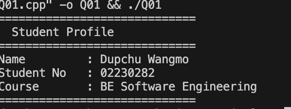
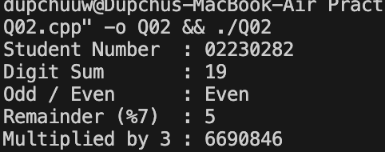
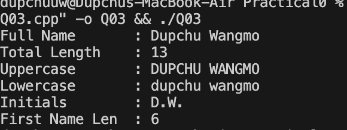
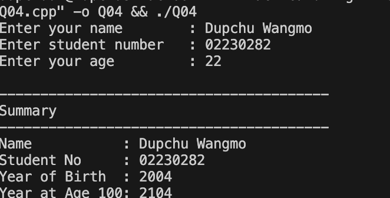
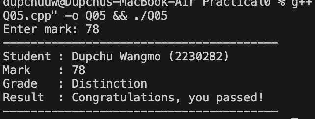
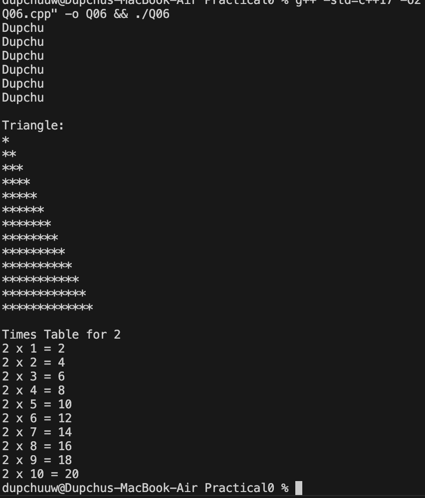
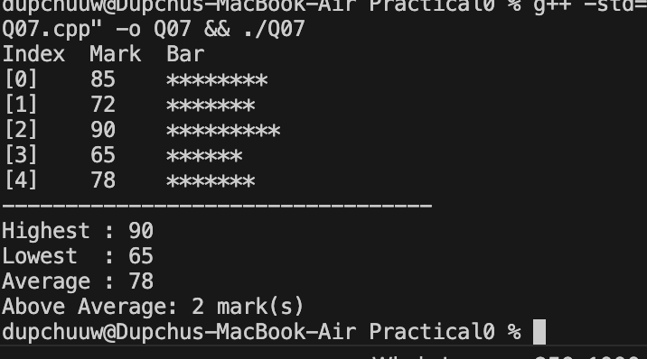
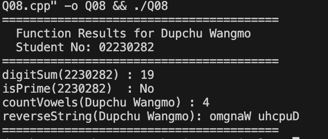
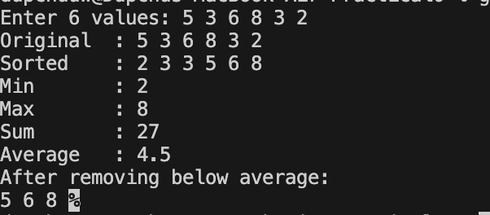
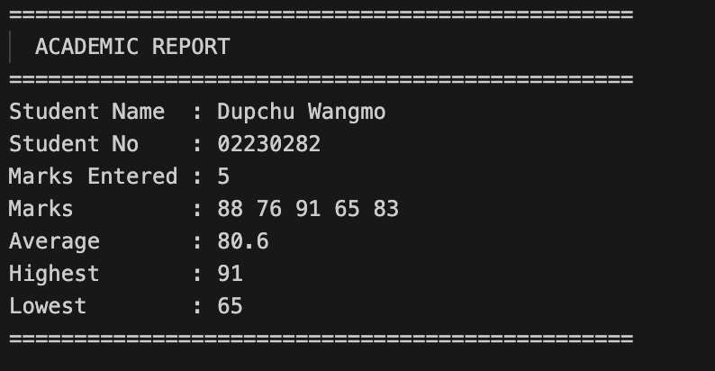

## Implementation Summary
Question 1: Personal Introduction

The first program created a simple personal profile using variables to store the student’s name, student number, and course. The information was displayed in a formatted output using cout.

Question 2: Arithmetic with Student Number

In this program, the student number was used to perform several arithmetic operations. The program calculated the sum of the digits, determined whether the number was odd or even, computed the remainder when divided by seven, and multiplied the student number by three.

Question 3: String Manipulation and Analysis

This task focused on string processing. The program calculated the total length of the student’s name, converted it to uppercase and lowercase, extracted the initials, and determined the length of the first name.

Question 4: User Input and Type Conversion

The program requested user input such as name, student number, and either age or birth year. Based on the input, it calculated the year of birth and the year when the student will turn 100 years old.

Question 5: Conditional Grade Classification

This program used if-else statements to classify a student's mark into categories such as Distinction, Merit, Pass, or Fail. Input validation ensured that marks outside the range of 0–100 were not accepted.

Question 6: Loop-Based Pattern Generation

Loops were used to repeat the student’s first name several times, generate a triangular star pattern, and print a multiplication table using the last digit of the student number.

Question 7: Array Operations and Statistics

An array containing five test marks was created. The program displayed each mark with its index, calculated the highest and lowest marks, computed the average score, counted how many marks were above the average, and displayed a visual bar representation using asterisks.

Question 8: Function Design and Modular Programming

Several functions were implemented to perform specific tasks. These included calculating the digit sum of a number, checking whether a number is prime, counting vowels in a string, and reversing a string.

Question 9: Vector and Dynamic Collections

The Standard Template Library (STL) vector container was used to store six user-entered values. The program displayed the values before and after sorting, calculated the minimum, maximum, sum, and average, and removed all numbers below the average.

Question 10: Classes and Object-Oriented Design

A Student class was designed with private attributes including name, student number, and marks. Methods were implemented to add marks, calculate average, find highest and lowest marks, and print a formatted academic report. This demonstrated encapsulation and object-oriented programming principles.

## Conclusion

This practical provided valuable experience in applying fundamental C++ programming concepts. By completing these tasks, important skills such as problem solving, logical thinking, and code organization were developed. The exercise also demonstrated the importance of modular programming and object-oriented design in creating structured and maintainable programs.

Overall, the practical strengthened understanding of C++ programming and its application in solving real-world computational problems.