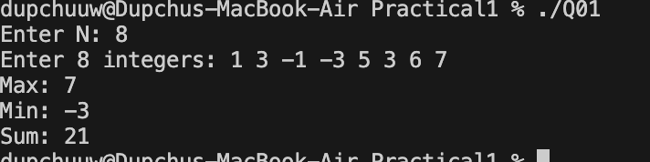
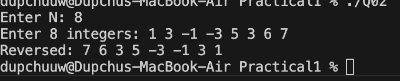
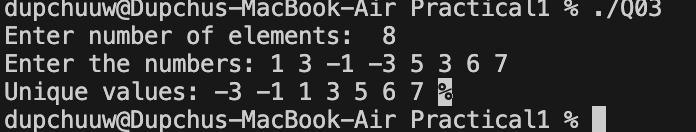
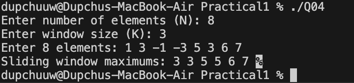
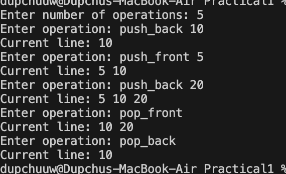
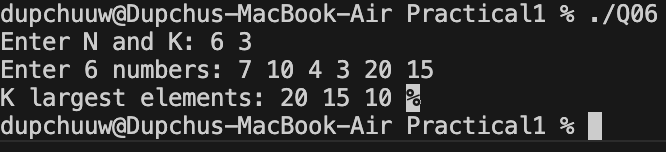
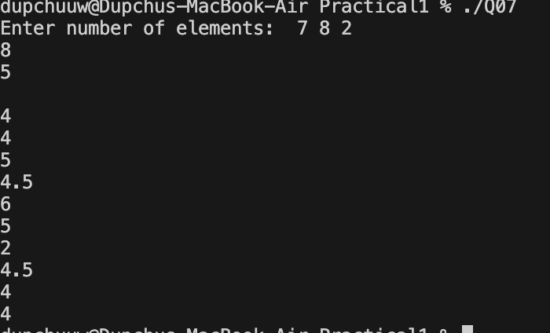
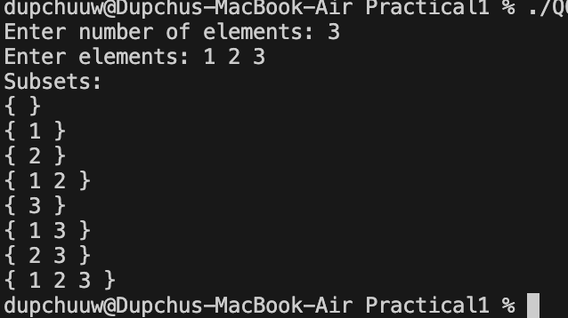
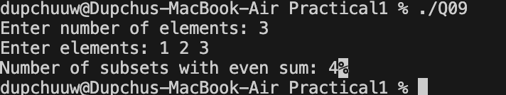
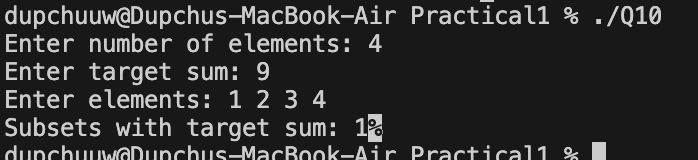

# CP Practicals Analysis

## Problem 1 – Dynamic Array Basics

### Problem Summary
Read N integers, store them in a vector, and compute maximum, minimum, and sum.

### Algorithm Explanation
We store elements in a vector and iterate once to calculate max, min, and sum.

### Time Complexity
O(N)

### Space Complexity
O(N)

### Reflection
This problem helped me understand how vectors work and how to traverse them efficiently.

## Problem 2 – Reverse Array
### Problem Summary
Print the array elements in reverse order.

### Algorithm Explanation
Traverse the vector from the last index to the first.

### Time Complexity
O(N)

### Space Complexity
O(N)

### Reflection
Learned how reverse traversal works without modifying the original array.

## Problem 3 – Remove Duplicates

### Problem Summary
Remove duplicate elements from a list.

### Algorithm Explanation
Sort the array, then use `unique()` and `erase()` to remove duplicates.

### Time Complexity
O(N log N)

### Space Complexity
O(N)

### Reflection
Learned how sorting helps simplify duplicate removal.

## Problem 4 – Sliding Window Maximum

### Problem Summary
Find the maximum in every window of size K.

### Algorithm Explanation
Use a deque to store useful indices and maintain decreasing order.

### Time Complexity
O(N)

### Space Complexity
O(K)

### Reflection
Initially I thought of brute force, but deque optimized it significantly.

## Problem 5 – Balanced Line Problem

### Problem Summary
Simulate a line using push and pop operations.

### Algorithm Explanation
Use deque to allow insertion/removal from both ends.

### Time Complexity
O(N)

### Space Complexity
O(N)

### Reflection
Understood how deque is useful for double-ended operations.

## Problem 6 – K Largest Elements

### Problem Summary
Find K largest elements from a list.

### Algorithm Explanation
Use a max heap (priority_queue) and extract K elements.

### Time Complexity
O(N log N)

### Space Complexity
O(N)

### Reflection
Learned how heaps help in efficiently retrieving largest values.

## Problem 7 – Running Median

### Problem Summary
Find median after each insertion.

### Algorithm Explanation
Use two heaps:
- Max heap for left half
- Min heap for right half

Balance both heaps.

### Time Complexity
O(log N) per insertion

### Space Complexity
O(N)

### Reflection
This problem improved my understanding of heap balancing.

## Problem 8 – Subset Generation

### Problem Summary
Generate all subsets of a set.

### Algorithm Explanation
Use bitmasking to generate all combinations.

### Time Complexity
O(2^N * N)

### Space Complexity
O(1)

### Reflection
Learned how binary representation helps generate subsets.

## Problem 9 – Count Even Sum Subsets

### Problem Summary
Count subsets with even sum.

### Algorithm Explanation
Generate all subsets using bitmask and check sum.

### Time Complexity
O(2^N * N)

### Space Complexity
O(1)

### Reflection
Understood subset generation and condition checking.

## Problem 10 – Subsets with Target Sum

### Problem Summary
Count subsets whose sum equals a target value.

### Algorithm Explanation
Generate subsets and compare sum with target.

### Time Complexity
O(2^N * N)

### Space Complexity
O(1)

### Reflection
Learned how brute-force subset checking works and when it's acceptable.