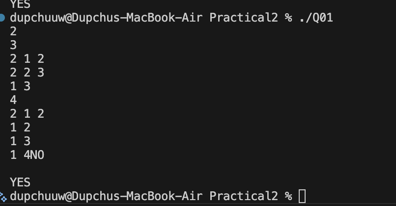
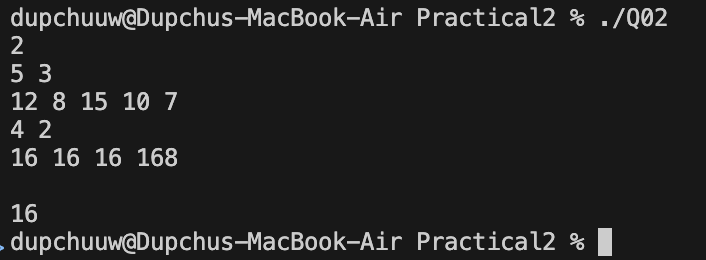
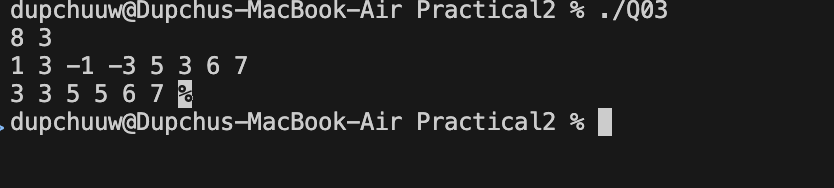
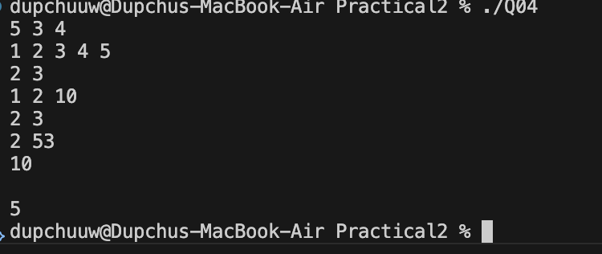
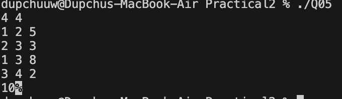
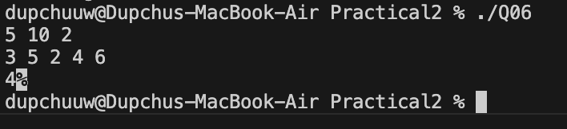

# CP Advanced Practicals Analysis

## Problem 1 – Dinner Table Arrangements

### Problem Summary

We are given N friends, each with a set of allergies. The goal is to arrange them in a circular table such that no two adjacent friends share any common allergy.

### Algorithm Explanation

Each friend's allergies are converted into a bitmask. A permutation of all friends is generated, and for each arrangement, we check whether adjacent bitmasks have a bitwise AND equal to zero. If all adjacent pairs satisfy this condition (including first and last), the arrangement is valid.

### Time Complexity

O(N! × N) in the worst case due to permutation generation.

### Space Complexity

O(N) for storing masks.

### Reflection

This problem helped me understand how bitmasking can efficiently represent sets. I also learned that permutation-based brute force can work when constraints are small, but optimization is necessary for larger inputs.

## Problem 2 – Maximum AND Subarray

### Problem Summary

Given an array, we must find the maximum possible bitwise AND of any subarray of size K.

### Algorithm Explanation

We use a greedy bitwise approach by checking bits from the most significant to least significant. For each bit, we attempt to include it in the result and verify whether there exists a subarray of size K where all elements contain that bit.

### Time Complexity

O(32 × N), since we check each bit for all elements.

### Space Complexity

O(1)

### Reflection

This problem improved my understanding of bitwise operations and greedy strategies. Instead of checking all subarrays, I learned to build the answer bit by bit.

## Problem 3 – Sliding Window Maximum

### Problem Summary

Find the maximum value in every subarray (window) of size K.

### Algorithm Explanation

A deque is used to store indices of useful elements. It maintains elements in decreasing order so that the front always represents the maximum element in the current window.

### Time Complexity

O(N)

### Space Complexity

O(K)

### Reflection

Initially, I considered a brute force approach, but it was inefficient. Using a deque showed me how data structures can optimize repeated computations.

## Problem 4 – Sliding Window Maximum with Updates

### Problem Summary

We process update queries on an array and also answer queries to find the maximum in a sliding window ending at a given index.

### Algorithm Explanation

For updates, we directly modify the array. For queries, we compute the maximum in the required window using a simple loop (brute force approach).

### Time Complexity

O(K) per query

### Space Complexity

O(N)

### Reflection

This problem showed how combining updates with queries increases complexity. While I used a simple approach, I learned that advanced data structures like segment trees could improve efficiency.

## Problem 5 – Network Latency

### Problem Summary

Find the minimum time required to send a packet from router 1 to router N in a weighted graph.

### Algorithm Explanation

We use Dijkstra’s algorithm with a priority queue to compute the shortest path from node 1 to node N. The graph is represented using an adjacency list.

### Time Complexity

O((N + M) log N)

### Space Complexity

O(N + M)

### Reflection

This problem helped me understand shortest path algorithms in graphs. I learned how priority queues are used to efficiently select the next node with minimum distance.

## Problem 6 – Shortest Path with Toll Booths

### Problem Summary

We must travel from booth 1 to booth N while minimizing time, given constraints on coins and limited skip operations.

### Algorithm Explanation

Dynamic Programming is used where dp[i][k] represents the minimum time to reach booth i using k skips. We consider both options: paying the toll or skipping the booth.

### Time Complexity

O(N × K)

### Space Complexity

O(N × K)

### Reflection

This problem strengthened my understanding of dynamic programming with multiple states. I learned how to track constraints like skips and optimize decisions accordingly.

# Overall Reflection

These problems covered multiple important concepts such as bitmasking, greedy algorithms, sliding window techniques, graph algorithms, and dynamic programming. Solving them improved my problem-solving skills and helped me understand how to choose appropriate data structures and algorithms based on constraints.
