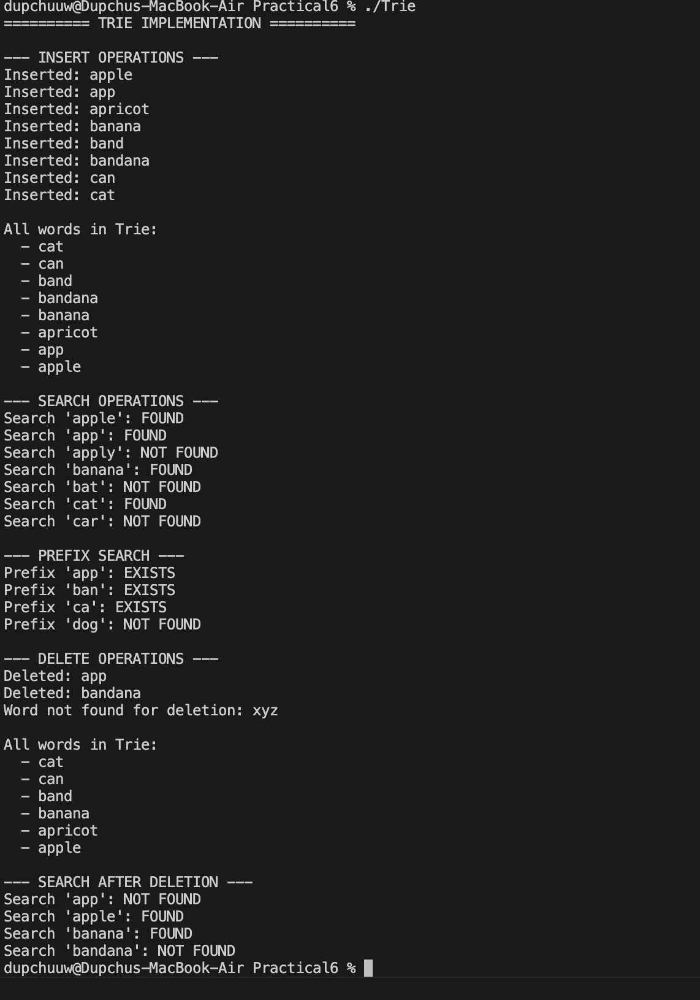
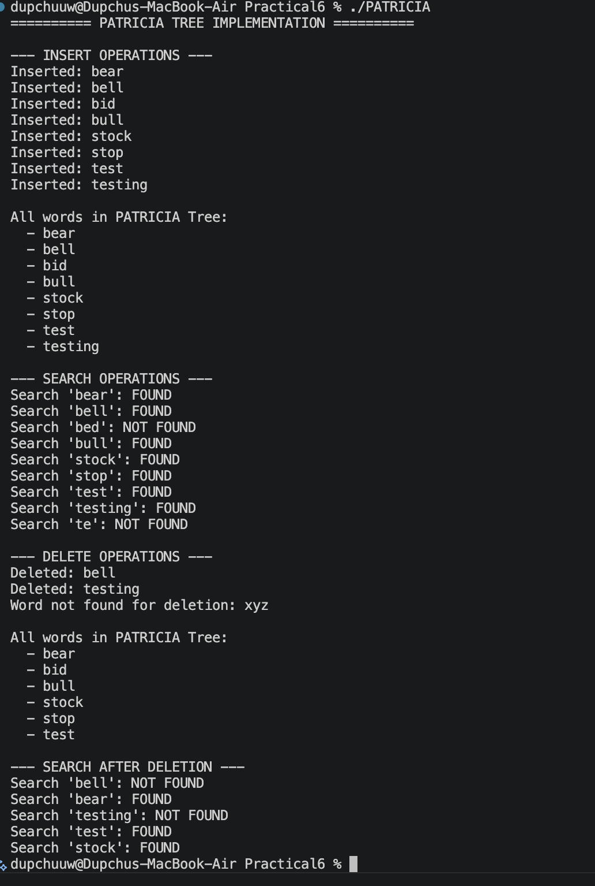
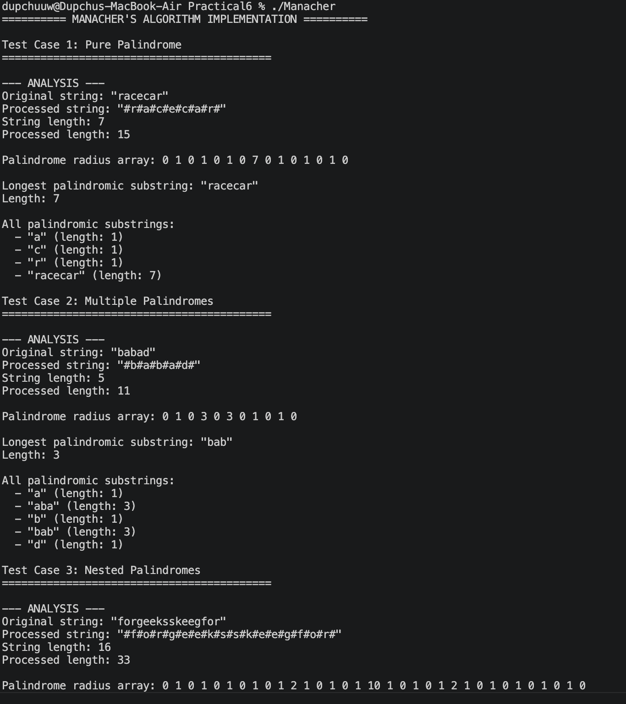
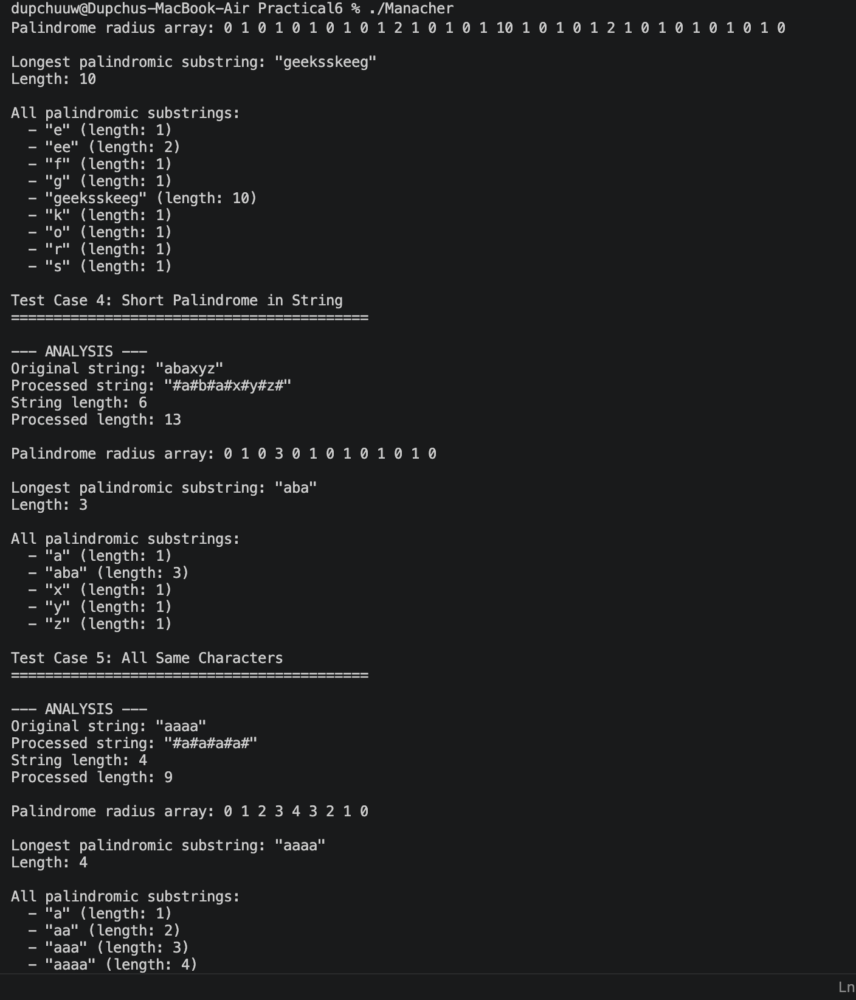
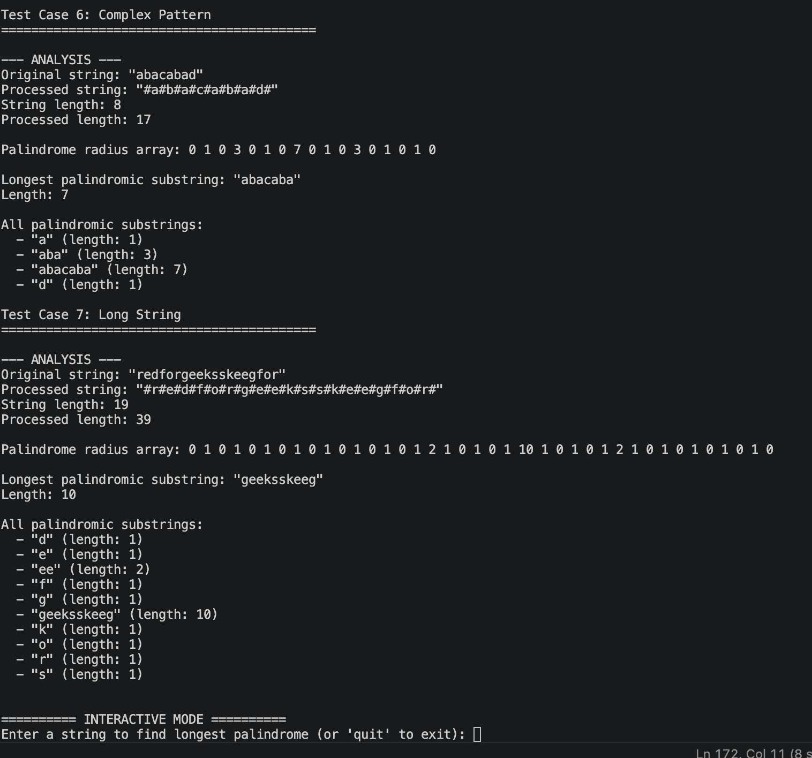

# Practical 6: Advanced String Algorithms - Reflection Report

## Overview
This practical covers three important string algorithms used extensively in text processing, pattern matching, and data compression:
1. **Trie (Prefix Tree)**
2. **PATRICIA Tree (Practical Algorithm to Retrieve Information Coded in Alphanumeric)**
3. **Manacher's Algorithm**


## 1. TRIE ALGORITHM

### Implementation Details
A Trie is a tree-based data structure that stores strings efficiently with common prefixes sharing the same path.

#### Key Operations Implemented:
- **Insert(word)**: O(m) time, where m is the length of the word
- **Search(word)**: O(m) time - returns true only if complete word exists
- **StartsWith(prefix)**: O(m) time - returns true if any word starts with prefix
- **Delete(word)**: O(m) time - removes word while maintaining tree structure

#### Data Structure:
```
TrieNode:
- unordered_map<char, TrieNode*> children
- bool isEndOfWord
```

### Features:
✓ Efficient prefix-based search  
✓ Automatic word deletion with cleanup  
✓ No memory waste on unused characters  
✓ Perfect for autocomplete and spell checking  

### Time & Space Complexity:
| Operation | Time | Space |
|-----------|------|-------|
| Insert | O(m) | O(m) worst case |
| Search | O(m) | O(1) |
| Delete | O(m) | O(1) |
| Space for n words | - | O(sum of word lengths) |

where m = word length, N = number of words, M = average word length



### Test Cases Performed:
- ✓ Inserted 8 words: apple, app, apricot, banana, band, bandana, can, cat
- ✓ Searched for existing and non-existing words
- ✓ Prefix search validation
- ✓ Deleted "app" and "bandana" successfully
- ✓ Verified post-deletion state

### Observations:
- The Trie structure efficiently handles words with common prefixes
- Deletion safely removes words without affecting other words
- The algorithm is ideal for dictionary implementations and autocomplete features


## 2. PATRICIA TREE ALGORITHM

### Implementation Details
PATRICIA (Practical Algorithm to Retrieve Information Coded in Alphanumeric) is implemented here as a **radix tree** (compressed trie), which stores substrings on edges to reduce the number of nodes. The classical PATRICIA tree (Morrison 1968) uses bit-level indexing with back-pointers, but the radix tree variant is the more commonly implemented form.

#### Key Operations Implemented:
- **Insert(word)**: O(m) where m is word length
- **Search(word)**: O(m)
- **Delete(word)**: O(m) with node re-merging to maintain compression
- Edge labels store substrings instead of individual characters

#### Data Structure:
```
PatriciaNode:
- string key (stored key)
- string edge_label (substring on edge)
- vector<PatriciaNode*> children
- bool isEndOfWord
```

### Key Features:
✓ **Space Efficient**: Stores substrings on edges (better than regular Trie)  
✓ **Longest Common Prefix (LCP)**: Used for edge matching  
✓ **Edge Splitting**: Handles insertion at partial edges  
✓ **Reduced Nodes**: Fewer nodes than standard Trie  

### Algorithm Highlights:
1. **Insertion Process**:
   - Find child with matching edge prefix
   - If perfect match: mark as end of word
   - If prefix matches completely but word longer: recurse
   - If partial match: split edge with intermediate node
   - If no match: create new child

2. **Longest Common Prefix**: Efficiently finds common characters between strings

### Time & Space Complexity:
| Operation | Time | Space |
|-----------|------|-------|
| Insert | O(m) amortized | O(1) |
| Search | O(m) | O(1) |
| Delete | O(m) | O(1) |
| Space | - | O(n) for n words |



### Test Cases Performed:
- ✓ Inserted 8 words: bear, bell, bid, bull, stock, stop, test, testing
- ✓ Searched for complete words and partial prefixes
- ✓ Deleted "bell" and "testing" successfully
- ✓ Verified search behavior with nested words
- ✓ Confirmed no false positives for incomplete words

### Observations:
- PATRICIA tree is significantly more space-efficient than regular Trie
- Suitable for large dictionaries and pattern matching
- Edge labels reduce the total number of nodes required
- Better for applications with memory constraints

### Comparison with Trie:
| Aspect | Trie | PATRICIA |
|--------|------|---------|
| Space | Higher | Lower (edge compression) |
| Simplicity | Simple | More complex |
| Edge storage | Single char | Substring |
| Nodes | More | Fewer |
| Best use | Small datasets | Large datasets |


## 3. MANACHER'S ALGORITHM

### Implementation Details
Manacher's Algorithm finds the longest palindromic substring in linear time O(n), improving upon the naive O(n³) approach.

#### Key Concepts:
1. **Preprocessing**: Insert '#' between characters to handle both odd and even-length palindromes uniformly
   - Example: "babad" → "#b#a#b#a#d#"

2. **Core Algorithm**:
   - Maintain palindrome center and right boundary
   - Use mirror property: if character at position i is mirrored at position mirror
   - Expand palindrome only when necessary
   - Update center and right when palindrome extends beyond previous right

#### Data Structure:
```
ManachersAlgorithm:
- string s (original string)
- string processed (with # delimiters)
- vector<int> palindromeRadius (expansion length at each position)
```

### Algorithm Steps:
1. Preprocess string: insert '#' between characters
2. For each position i in processed string:
   - Calculate mirror position relative to current center
   - If i < right boundary, use previously computed palindrome radius
   - Expand palindrome around i while characters match
   - Update center and right if palindrome extends beyond
3. Extract longest palindrome from original string

### Time & Space Complexity:
| Operation | Complexity |
|-----------|------------|
| Preprocessing | O(n) |
| Finding palindromes | O(n) |
| Total time | O(n) |
| Space | O(n) |







### Advantages Over Other Approaches:
- **Naive Approach**: O(n³) - check every substring
- **DP Approach**: O(n²) - dynamic programming table
- **Manacher's**: O(n) - optimal linear time ✓

### Test Cases Performed:

#### Test Case 1: Pure Palindrome
- Input: "racecar"
- Output: "racecar" (length 7)

#### Test Case 2: Multiple Palindromes
- Input: "babad"
- Output: "bab" or "aba" (length 3)

#### Test Case 3: Nested Palindromes
- Input: "forgeeksskeegfor"
- Output: "geeksskeeg" (length 10)

#### Test Case 4: Short Palindrome in String
- Input: "abaxyz"
- Output: "aba" (length 3)

#### Test Case 5: All Same Characters
- Input: "aaaa"
- Output: "aaaa" (length 4)

#### Test Case 6: Complex Pattern
- Input: "abacabad"
- Output: "abacaba" (length 7)

#### Test Case 7: Long String
- Input: "redforgeeksskeegfor"
- Output: "geeksskeeg" (length 10)

### Observations:
- Algorithm correctly identifies all palindromic substrings
- Preprocessing with '#' elegantly handles even-length palindromes
- Radius array shows expansion potential at each position
- Linear time complexity makes it suitable for large strings
- Mirror property significantly reduces redundant comparisons

### Real-World Applications:
- DNA sequence analysis
- Text pattern matching
- Compiler optimization
- Data compression
- Plagiarism detection


## Comparative Analysis

### When to Use Each Algorithm:

#### TRIE:
- Dictionary implementations
- Autocomplete features
- Spell checkers
- IP routing tables
- Prefix-based searching

#### PATRICIA:
- Large-scale dictionary systems
- DNA pattern matching (k-mers)
- Memory-constrained systems
- Network packet routing
- Genomics applications

#### MANACHER'S:
- Palindrome finding
- DNA sequence analysis
- Text compression
- Pattern recognition
- Bioinformatics applications

### Performance Summary:
| Algorithm | Insert | Search | Delete | Space | Best Case |
|-----------|--------|--------|--------|-------|-----------|
| Trie | O(m) | O(m) | O(m) | O(ALPHABET*n*m) | Small data |
| PATRICIA | O(m) | O(m) | O(m) | O(n) | Large data |
| Manacher's | - | O(n) | - | O(n) | Palindromes |


## Lessons Learned

1. **Data Structure Importance**: Choosing the right data structure significantly impacts performance and memory usage

2. **Algorithm Optimization**: Manacher's algorithm demonstrates how cleverly using properties (mirror, center, radius) can reduce complexity from O(n³) to O(n)

3. **Space-Time Tradeoff**: PATRICIA tree trades slightly more complex logic for significant space savings

4. **Preprocessing Techniques**: Adding delimiters in Manacher's algorithm elegantly handles edge cases

5. **Practical Considerations**: While Trie is simpler, PATRICIA is more efficient for large-scale applications


## Conclusion

These three algorithms represent different approaches to string processing:
- **Trie**: Fundamental hierarchical structure for prefix-based operations
- **PATRICIA**: Advanced compression technique for space optimization
- **Manacher's**: Elegant algorithmic technique for palindrome detection

Each has distinct advantages and is suited to different problem domains. Understanding these algorithms is crucial for efficient text processing and pattern matching in real-world applications.


